🧑‍💻 Laboratório Prático - Git e Github
Este laboratório prático tem como objetivo exercitar as principais funcionalidades do Git e GitHub, como criação de repositórios, adição de arquivos, commits, push, pull, e gerenciamento de branches. Vamos criar um pequeno projeto para simular um fluxo de trabalho real. Neste arquivo, foram adicionados prints das telas de cada um dos passos realizados no terminal, e suas respostas.

⚙️ 1. Configuração Inicial do Git
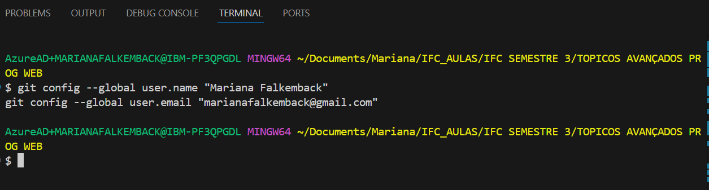

📁 2. Criar um Repositório Local
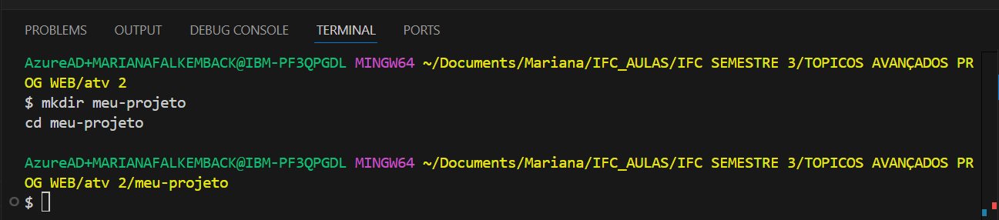

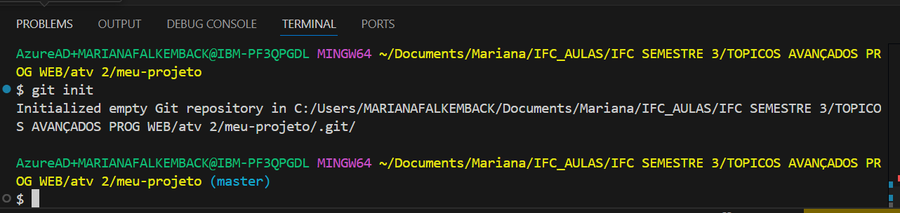

📝 3. Adicionar Arquivos e Fazer Commit
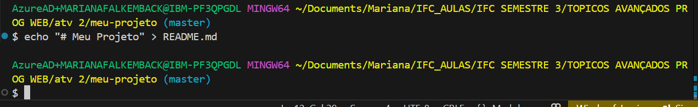

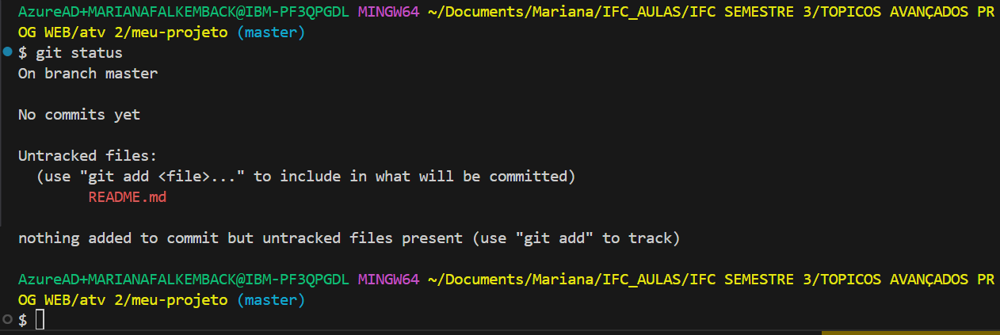

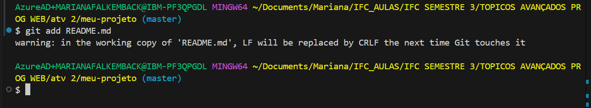

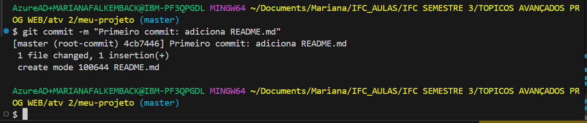

🌐 4. Criar um Repositório no GitHub
Acessei o GitHub e criei um repositório com as seguintes configurações:

Nome: meu-projeto

Visibilidade: Público

Sem README, .gitignore ou licença

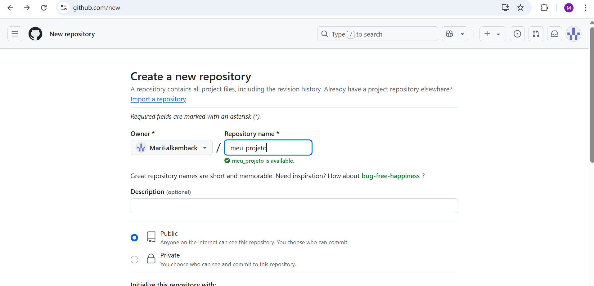
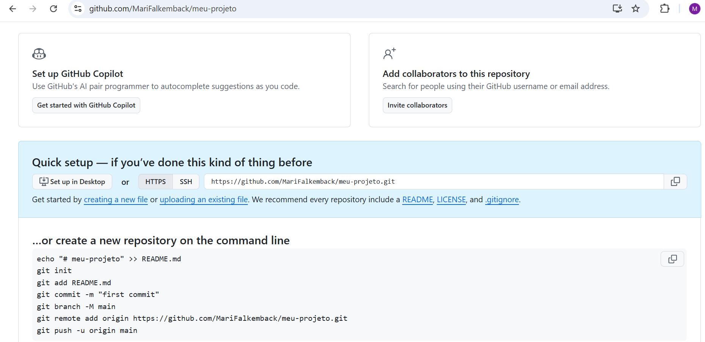

🔗 5. Conectar o Repositório Local ao GitHub
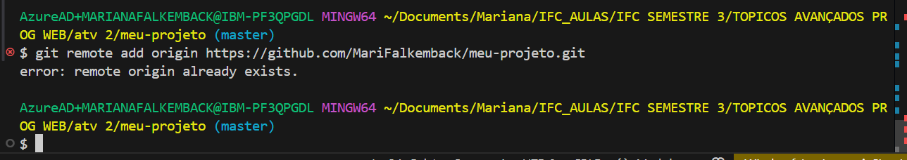
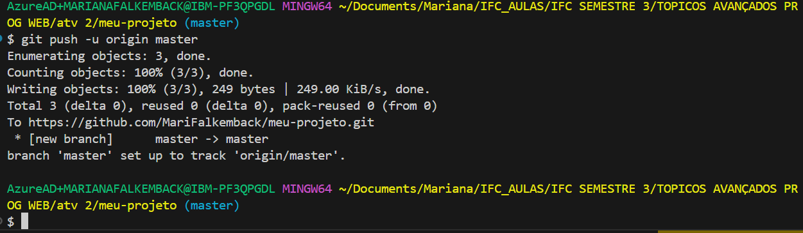

✨ 6. Criar e Trabalhar em uma Nova Branch

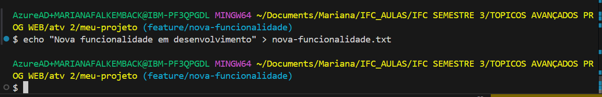

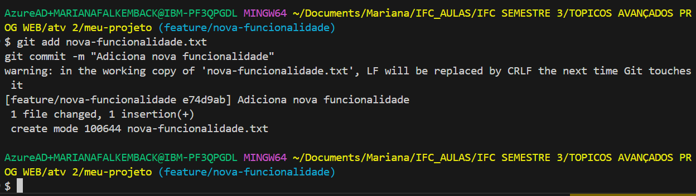

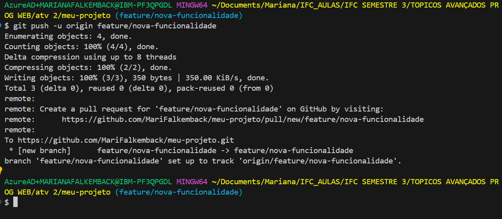

🔀 7. Fazer Merge da Branch na Master
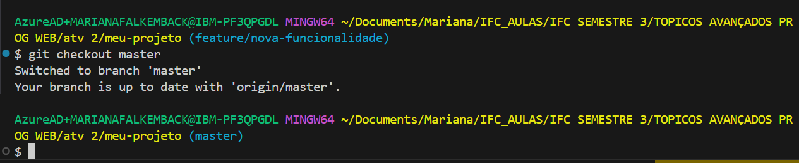

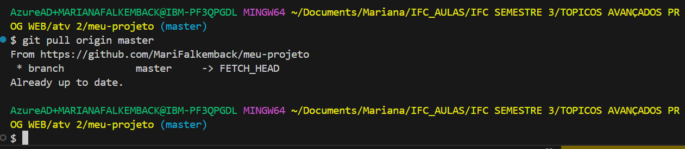

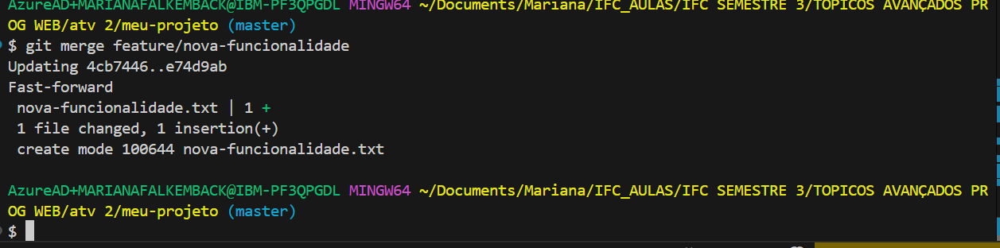

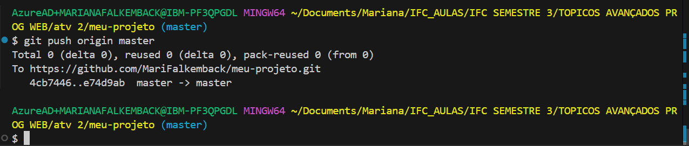

✅ Resumo do Laboratório

📂 Repositório local: Criado com git init

📌 Commits: Realizados com git add e git commit

☁️ Repositório remoto: Conectado ao GitHub com git remote add e git push

🌲 Branches: Criadas e mescladas com git checkout, git merge.